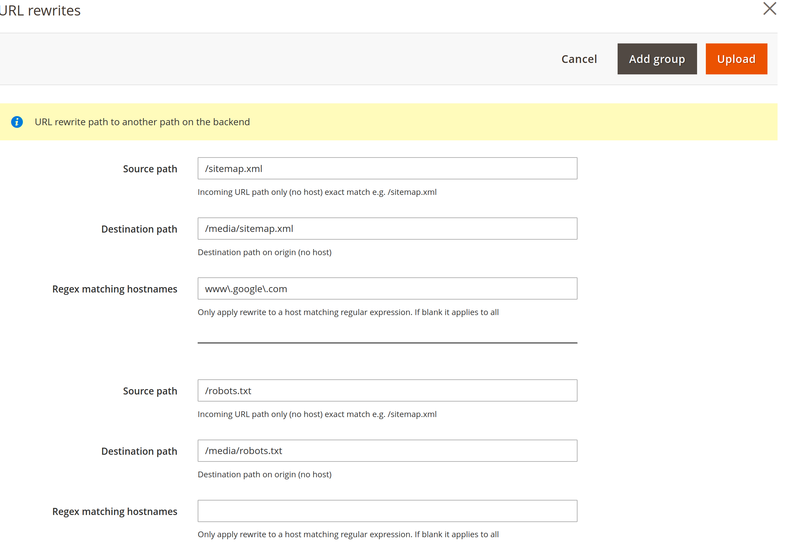

# Fastly Edge Modules - URL rewrites

This guide will show how to configure URL rewritesto point to the correct URL on the backend. Before you can use Fastly
Edge Modules you need to [make sure they are enabled](https://github.com/fastly/fastly-magento2/blob/master/Documentation/Guides/Edge-Modules/EDGE-MODULES.md)

When you click on the configuration you will be prompted with a screen like this




Purpose of this module is to rewrite the location of the sitemap.xml file. It is not a redirect. You can specify multiple rewrites by clicking
Add Group button

## Configurable options

### Source path

Source URL path. Typically this will be `/sitemap.xml`

### Destination path

Destination path e.g. `/media/sitemap.xml`

### Regex matching hostnames

Regular expression that matches a set of hostnames e.g. `www\.google\.com` or `^google\.com`. If it's left
blank it will apply to all hosts

## Enabling

After any change to the settings you need to click Upload as that will upload require VCL code to Fastly.

## Technical details

Following VCL snippets are being uploaded. Feel free to use them as custom snippets if module doesn't do what you expect.

Snippet Type: vcl_miss

```vcl
if (!req.backend.is_shield && req.url.path == "/sitemap.xml") {
  set bereq.url = "/media/sitemap.xml";
}
```

Snippet Type: vcl_pass

```vcl
if (!req.backend.is_shield && req.url.path == "/sitemap.xml") {
  set bereq.url = "/media/sitemap.xml";
}
```
